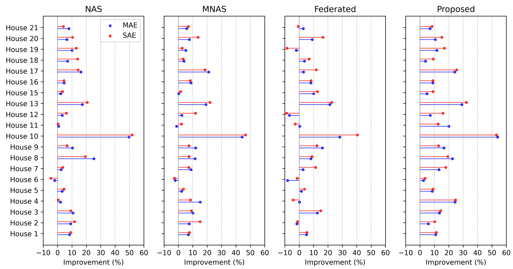
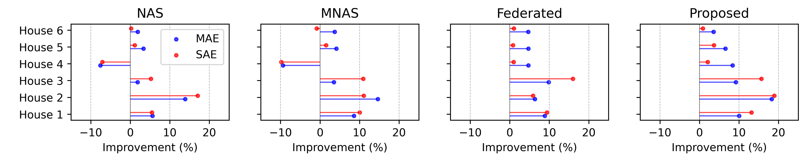

# Lightweight_Federated_NILM

This is the codebase for our paper "Lightweight Federated Learning for On-Device Non-intrusive Load Monitoring".

## Overview

Non-intrusive load monitoring (NILM) is a critical technology to disaggregate appliance-specific energy usage by only observing household-level power consumption. If NILM can be performed on end devices (such as smart meters), it can facilitate electricity demand identification and electricity behaviour perception for real-time demand-side energy management. To this end, this paper proposes a lightweight federated learning approach for on-device NILM by combining neural architecture search (NAS) and federated learning. Case studies on two real-world datasets verify that the proposed method for appliance-level power disaggregation outperforms conventional methods in both accuracy and efficiency.

## Dataset

The current version supports the following datasets and tasks are saved in `dataset`:

```bash
- REFIT: appliance-level power consumption of 20 houses in UK with a time resolution of 8 seconds.
- REDD: appliance-level power consumption of 6 houses in USA with a time resolution of 3 seconds.
```

## Test
You can evaluate this code with Python 3.10+ and PyTorch 1.4.0+.

To use the provided code, please run `test.ipynb` to obtain the results of the proposed method and benchmark methods.

> **Note:** Please select dataset and appliance to be tested before use.

```bash
dataset = 'dataset/REFIT/'
appliance = 'Fridge'
```

## Experimental results

Enable resource-constrained smart meters to execute accurate on-device NILM!

- Performance comparison


- Model Effectiveness



